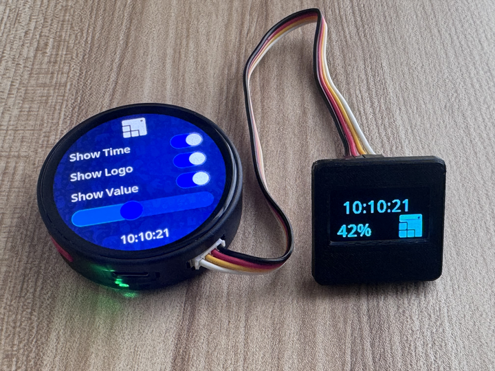

# Dual Screen UI

LVGL UI project for a dual-display device: a round 466 x 466 primary screen with a 128 x 64 secondary OLED-style view. The project is exported from LVGL Editor and includes generated C sources, component definitions, fonts, images, a desktop simulator, and a browser preview bundle.



## Preview

Open the project in the [LVGL Online Viewer](https://viewer.lvgl.io/?repo=https://github.com/lvgl-pro-projects/fbiego--dual_screen) to inspect and interact with the UI in a browser.


## Using In Firmware

The companion firmware project is available at:

https://github.com/fbiego/lv-dual-screen

Add this UI project to an LVGL firmware build and call:

```c
dual_screen_init(asset_path);
```


